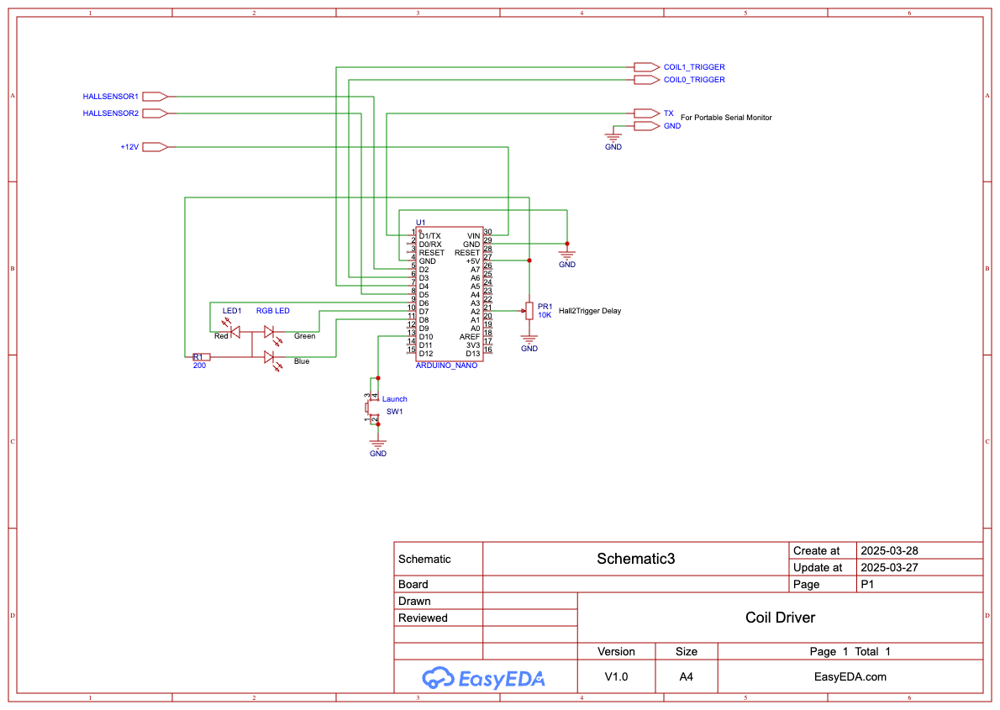
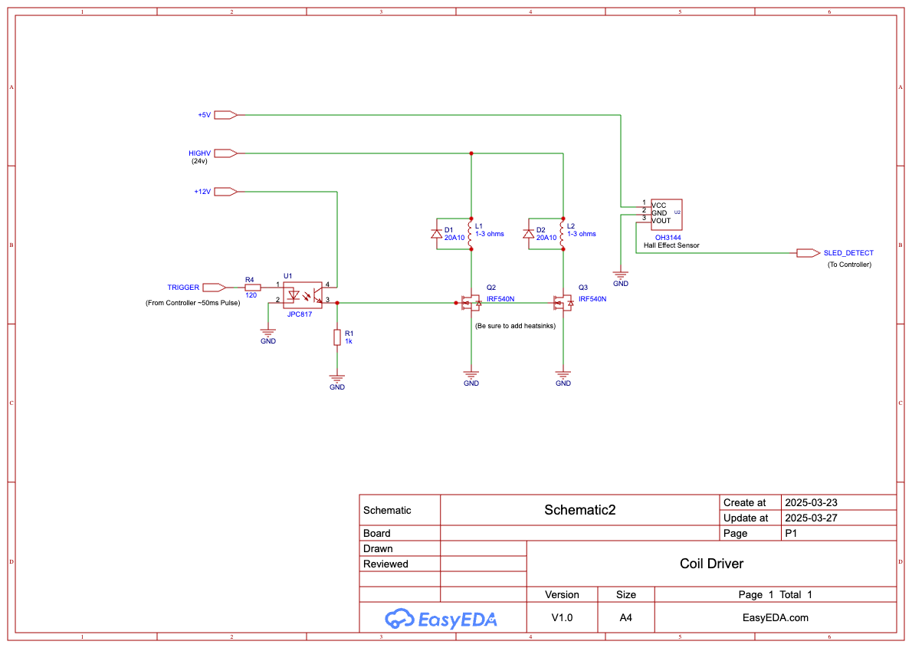

### coilLauncher
Arduino Nano based code for controlling a magnetic coil rail launcher
o
     coilLauncher - An Arduino nano controls the triggering and timing of two sets
     of electromagnets to propel a sled down a rail.  Used to experiment with the
     power and timing of triggering and how it affects the launch energy of the sled

     Hall effect sensors detect when the sled has moved into a position right before the
     next set of coils with a final detector in place to calculate the final speed of the sled.

     A three color LED is used to indicate state.  Green: Ready to trigger, Red: coils active,
     Blue: coil cool down period where you are locked out from re-triggering the coils.

     A pot is included to vary the hold off time from when the first set of coils trigger until
     the second set of coils trigger.   The magnets are wound so as to repulse the magnet in 
     the sled so the sled needs to travel just past center of the coil before the coil energizes 
     else we will end up slowing the sled rather than accelerating it.

     A fail-safe timer is used to be sure the coils are never energized for more than a pre-set 
     amount of time in case anything goes wrong (we don't want to melt the coils!).

     dlf  4/4/2025

### Schematics

### Pictures

